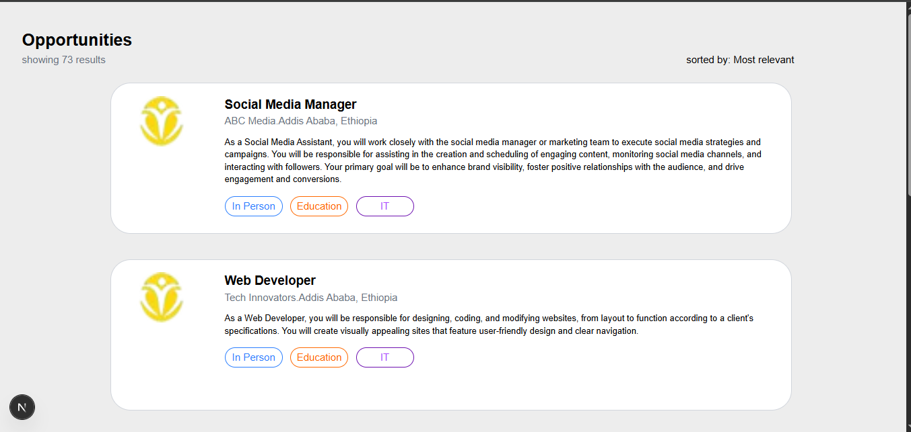
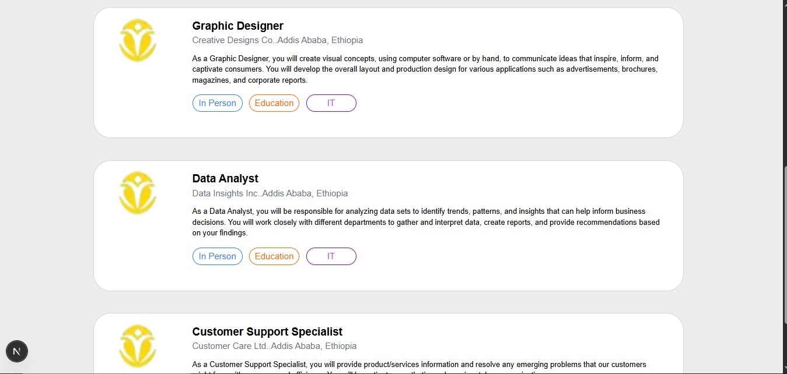

# 💼 Job Listing Website (Next.js + TypeScript + Tailwind CSS)

A simple and elegant job listing web app built using:

- Next.js (App Router)
- TypeScript
- Tailwind CSS

---

## 📑 Overview

This project includes:

- 🏠 Home Page: Lists all jobs with title, company, and short description.
- 📄 About Page: Displays detailed info about a single job.

Data is loaded from a local TypeScript file (job_postings.ts) to simulate a job board experience.

---
## Screen Shot
  
  
  